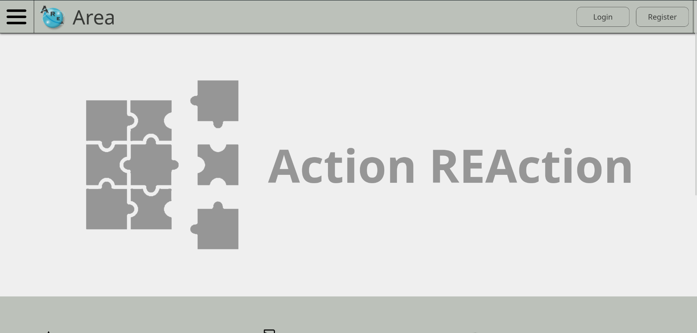

# AREA

This is the Epitech Project of TEK3: AREA.

## Table of Contents
- [Description](#description)
- [Installation](#installation)
- [Usage](#usage)
- [Documentation](#documentation)
- [Authors](#authors)
- [License](#license)

## Description

AREA is a project that aims to create an automation platform that allows users to create and manage their own applications (Discord, Spotify, Twitter, etc.) and automate their actions. The project is divided into three parts: the front-end, the back-end, and the services.

## Supported platforms

- Computer (Web)
- Mobile
    - Android
    - iOS

## Installation

1. Clone the repository:
```bash
git clone https://github.com:EpitechPromo2027/B-DEV-500-NAN-5-2-area-toavina.andriamanampisoa.git
cd B-DEV-500-NAN-5-2-area-toavina.andriamanampisoa
```

2. Run the project:

Make sure you have Docker installed on your machine.

```bash
sudo docker-compose up -d
```

3. Build and run the project for mobile:

Make sure you have Node.js installed on your machine.

```bash
./setup_mobile.sh
```

It will install the mobile part of the project.

You can now access for **Mobile** by opening *Android Studio* and running the `android/` or `iOS/` project.

## Usage
### Access the website (Computer)

To access the front-end, open your browser and go to:

```
http://localhost:8081
```

## Documentation

Access the documentation by launching running the docker-compose and going to:

```
http://localhost:8082
```

## Authors

AREA was developed as part of the Epitech Project of TEK3. Special thanks to the project team members for their contributions.

- [Clément](https://github.com/ClementBaziret/) - **Developer**
- [Steven](https://github.com/StevenGandon) - **Developer**
- [Bhuvan](https://github.com/BhuvanArn/) - **Developer**
- [Toavina](https://github.com/Andriamanampisoa/) - **Developer**
- [Erwann](https://github.com/Fizo55/) - **Developer**

## License
This project is licensed under the [MIT License](https://en.wikipedia.org/wiki/MIT_License) - see the LICENSE file for details.
